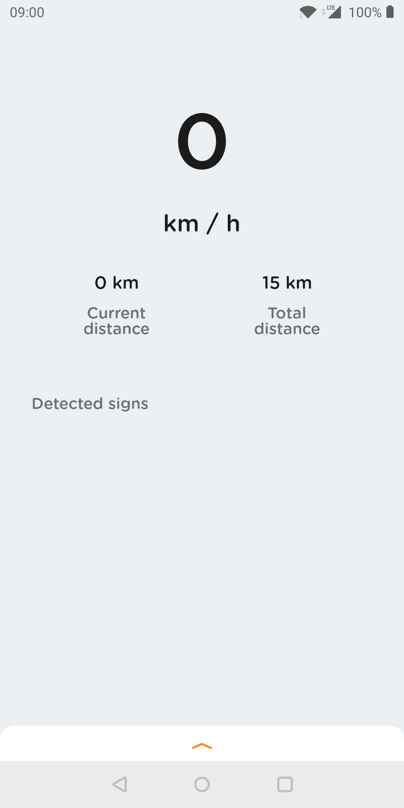

# Car Assistant Android
### Overview
This is a camera app that continuously detects the traffic signs in the frames seen by your device's back camera, using a quantized [MobileNet SSD](https://github.com/tensorflow/models/tree/master/research/object_detection) model trained on the own dataset.

   

